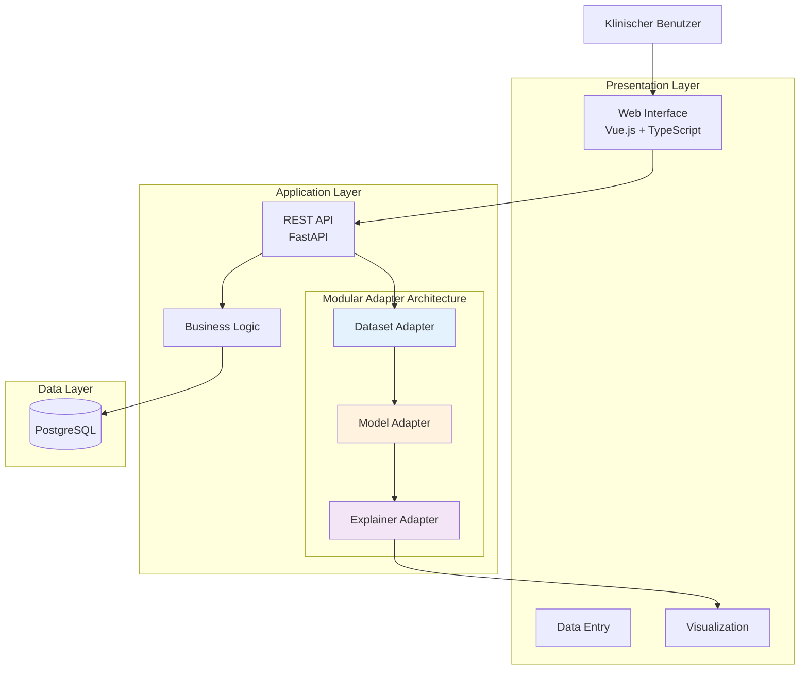
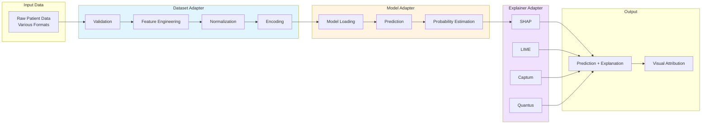
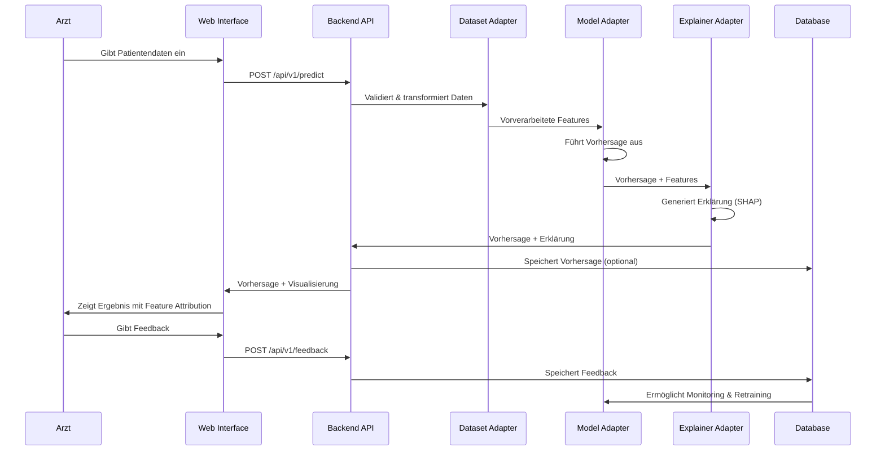
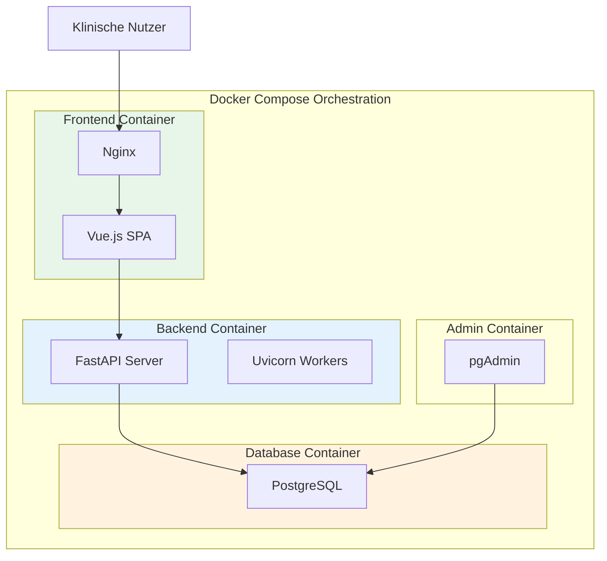

# XTab-CDS Architecture Diagrams

## Hauptarchitektur (für Paper)

### Mermaid-Code (bevorzugt für wissenschaftliche Papers)

```mermaid
graph TB
    subgraph "Klinischer Benutzer"
        User[👨‍⚕️ Arzt/Klinikpersonal]
    end
    
    subgraph "Frontend Layer (Vue.js)"
        UI[Benutzeroberfläche]
        PatientForm[Patienteneingabe]
        PredView[Vorhersage-Anzeige]
        ExplView[Erklärungen & Visualisierung]
        Feedback[Feedback-Formular]
    end
    
    subgraph "Backend Layer (FastAPI Python)"
        API[REST API Endpunkte]
        
        subgraph "Core Module - Adapter-Architektur"
            DataAdapter[📊 Dataset Adapter<br/>Datenvorverarbeitung<br/>Feature Engineering]
            ModelAdapter[🤖 Model Adapter<br/>ML-Modell Wrapper<br/>Vorhersagen]
            ExplainerAdapter[💡 Explainer Adapter<br/>SHAP/LIME<br/>Erklärungen]
        end
        
        CRUD[Patient Management]
        PredAPI[Prediction Service]
        FeedbackAPI[Feedback Service]
    end
    
    subgraph "Datenbank Layer"
        DB[(PostgreSQL<br/>Patienten<br/>Vorhersagen<br/>Feedback)]
    end
    
    subgraph "Deployment"
        Docker[🐳 Docker Container<br/>Reproduzierbare Umgebung]
    end
    
    User -->|Interaktion| UI
    UI --> PatientForm
    PatientForm -->|Patientendaten| API
    API --> CRUD
    CRUD --> DB
    
    API --> DataAdapter
    DataAdapter -->|Vorverarbeitete Features| ModelAdapter
    ModelAdapter -->|Vorhersage| PredAPI
    PredAPI -->|Vorhersage + Daten| ExplainerAdapter
    ExplainerAdapter -->|Erklärung| PredView
    
    PredView -->|Anzeige| UI
    ExplView -->|Anzeige| UI
    
    Feedback -->|Klinisches Feedback| FeedbackAPI
    FeedbackAPI --> DB
    
    DB -.->|Monitoring & Retraining| ModelAdapter
    
    Docker -.->|Container| Frontend Layer
    Docker -.->|Container| Backend Layer
    Docker -.->|Container| Datenbank Layer
    
    style DataAdapter fill:#e1f5ff
    style ModelAdapter fill:#fff4e1
    style ExplainerAdapter fill:#f0e1ff
    style User fill:#d4edda
    style DB fill:#f8d7da
```

---

## Vereinfachte Version (ohne Emojis, für formelle Papers)



---

## Adapter-fokussierte Ansicht (Detail der Kern-Architektur)



---

## Datenfluss-Diagramm (User Journey)



---

## Deployment-Architektur



---

## Empfehlungen für Paper-Integration

### Option 1: Mermaid direkt (wenn LaTeX-unterstützt)
Viele moderne LaTeX-Pakete unterstützen Mermaid:
- `mermaid-latex` Package
- Konvertierung mit `mmdc` (Mermaid CLI)

### Option 2: Export als PNG/SVG
```bash
# Mermaid CLI installieren
npm install -g @mermaid-js/mermaid-cli

# Diagramm exportieren
mmdc -i architecture.mmd -o architecture.png -w 1920 -H 1080
mmdc -i architecture.mmd -o architecture.svg
```

### Option 3: Online-Tools
1. **Mermaid Live Editor**: https://mermaid.live/
   - Code eingeben → als PNG/SVG exportieren
   
2. **Draw.io**: https://app.diagrams.net/
   - Für mehr Kontrolle über Design
   - Export als PNG, PDF, SVG

3. **Figma/Inkscape**:
   - Für publication-quality Diagramme

### Option 4: LaTeX TikZ
Für höchste Qualität in wissenschaftlichen Papers - ich kann auch TikZ-Code generieren.

---

## Beschreibungstext für Paper (Vorschlag)

**Figure X: XTab-CDS Framework Architecture Overview**

The framework implements a three-tier architecture consisting of:
1. **Presentation Layer**: Vue.js-based web interface enabling clinician interaction
2. **Application Layer**: FastAPI backend with modular adapter architecture
3. **Data Layer**: PostgreSQL database for persistent storage

The core innovation lies in the modular adapter architecture (center), which decouples:
- **Dataset Adapters**: Handle data preprocessing, validation, and feature engineering
- **Model Adapters**: Wrap ML models with unified prediction interfaces
- **Explainer Adapters**: Provide pluggable explanation methods (SHAP, LIME, etc.)

This separation enables the same infrastructure to support different clinical prediction tasks through configuration changes alone, without modifying the core application code. The feedback loop (bottom) enables continuous monitoring and model improvement based on clinician input.

---

## Legende/Glossar für Nicht-Informatiker

| Begriff | Erklärung |
|---------|-----------|
| **Frontend** | Die Benutzeroberfläche, die Ärzte sehen und bedienen |
| **Backend** | Die Logik im Hintergrund, die Berechnungen durchführt |
| **API** | Schnittstelle, die Frontend und Backend verbindet |
| **Adapter** | Austauschbare Module für verschiedene Datenquellen/Modelle |
| **SHAP/LIME** | Erklärungsmethoden, die zeigen, welche Faktoren die Vorhersage beeinflussen |
| **Docker Container** | Isolierte Umgebung, die überall gleich läuft |
| **PostgreSQL** | Datenbanksystem zur Speicherung von Patientendaten |
| **REST API** | Standard-Kommunikationsprotokoll zwischen Systemen |
| **Feature Engineering** | Aufbereitung von Rohdaten für das ML-Modell |

